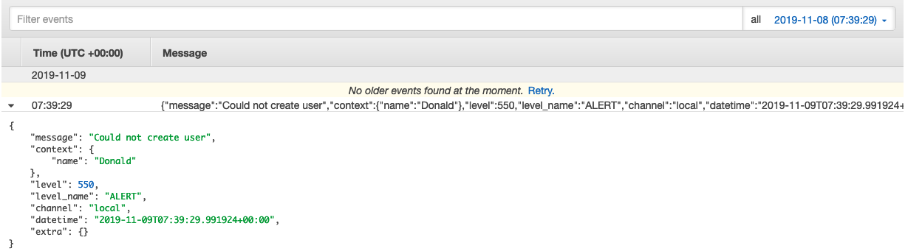

# AWS SDK for Modulus

The AWS SDK for Modulus makes it easy for developers to use Amazon Web Services in Modulus.

Install
-------

Require the package with composer:

```
composer require modulus/aws-sdk
```

Create a `aws.php` config file:

```php
<?php

return [
  'credentials' => [
    'key'    => env('AWS_ACCESS_KEY_ID', ''),
    'secret' => env('AWS_SECRET_ACCESS_KEY', ''),
  ],
  'region' => env('AWS_REGION', 'eu-west-1'),
  'version' => 'latest'
];

```

And finally set the correct environment variables in the `.env` file.

---

### Logging

The CloudWatch Monolog Driver allows you to store your Modulus logs in AWS. You can then easily view them, search them for specific error codes or patterns, filter them based on specific fields, or archive them securely for future analysis.

#### Getting Started

To start using CloudWatch, you need to add a new logging channel in the `logging.php` config file:

```php
'channels' => [
  ...

  'cloudwatch' => [
    'driver' => 'cloudwatch',
    'group_name' => env('CLOUDWATCH_GROUP_NAME', '/aws/modulus/application'),
    'steam_name' => env('CLOUDWATCH_STREAM_NAME', 'ec2-instance'),
    'days' => 14
  ]
];
```

After adding a new channel, you will need to register the `cloudwatch` driver in the `AppServiceResolver` boot function:

```php
use Modulus\Framework\Upstart\Service;
use Modulus\Hibernate\Logging\MonologBase;

class AppServiceResolver extends Service
{
  /**
   * Register application services
   *
   * @param mixed $app
   * @return void
   */
  protected function boot($app) : void {
    MonologBase::register(
      'cloudwatch',
      \Modulus\Aws\Services\CloudWatch\MonologDriver::class
    );
  }
}
```

Once you have registered the `cloudwatch` driver and added a new channel for `cloudwatch`, you can start logging to AWS CloudWatch:

```php
\Log::channel('cloudwatch')->info('Successfully created a new user', ['name' => 'Donald', 'age' => 22]);
```

If you want to use `cloudwatch` as the default channel, you can change the `logging.default` value to `cloudwatch` in the `logging.php` config file:

```php
<?php

return [
  'default' => 'cloudwatch',
  ...
```

Now when logging data, you won't need to specify the channel:

```php
\Log::alert('Could not create user', ['name' => 'Donald']);
```

Results:



Security
-------

If you discover any security related issues, please email donaldpakkies@gmail.com instead of using the issue tracker.

License
-------

The MIT License (MIT). Please see [License File](LICENSE) for more information.